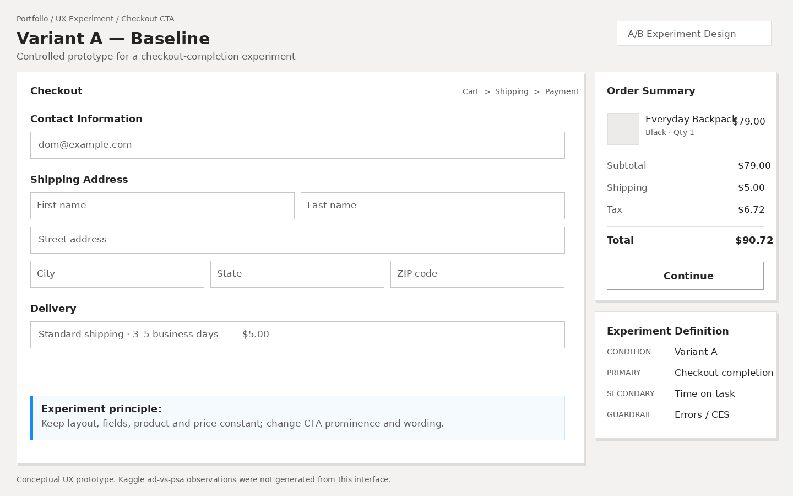
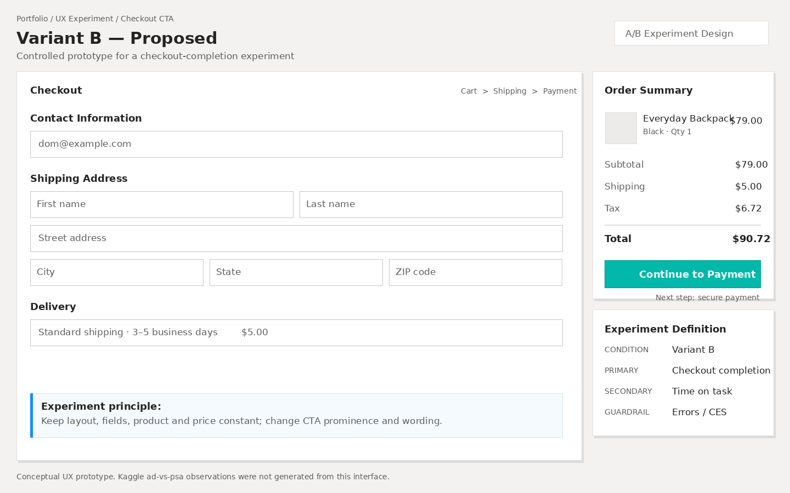
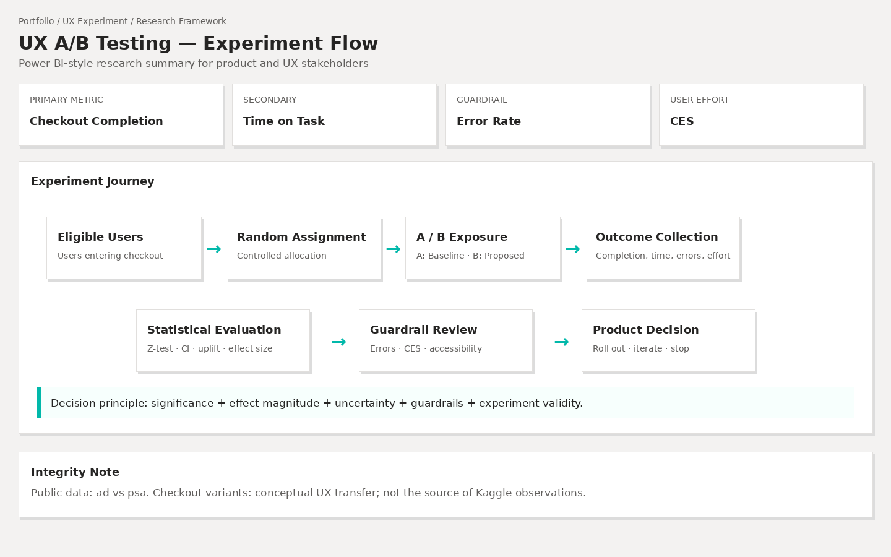

# UX A/B Testing & Evaluación Experimental

Proyecto end-to-end de **experimentación A/B y evaluación UX**, enfocado en medir diferencias de conversión entre tratamiento y control y demostrar cómo la evidencia estadística puede apoyar decisiones de Producto y UX.

El proyecto integra **Python, Pandas, NumPy, SciPy, Statsmodels, inferencia estadística, diseño experimental, experimentación UX, pruebas automatizadas, GitHub Actions y visualización interactiva de datos**.

> **Integridad de la investigación:** El dataset público compara un tratamiento publicitario (`ad`) con un grupo control que recibió un PSA (`psa`). Las pantallas UX Variant A / Variant B incluidas en este proyecto son una aplicación conceptual del framework de experimentación. Los datos públicos **no fueron generados a partir de estos prototipos UX**.

---

## Enlaces del proyecto

[Notebook de análisis](notebooks/01_ab_testing_analysis.ipynb) ·
[Diseño del experimento](research/experiment_design.md) ·
[Framework de métricas](research/metric_framework.md) ·
[Hallazgos del experimento](research/experiment_findings.md) ·
[Diseño UX](design/README.md) ·
[Dashboard](https://dbolanos-s.github.io/ux_ab_testing_analysis_complete/) ·
[Guía de pruebas](GITHUB_TESTING.md)

**Dashboard en vivo:** [Dashboard](https://dbolanos-s.github.io/ux_ab_testing_analysis_complete/)

---

# Descripción general del proyecto

Este proyecto evalúa un experimento A/B público desde la validación de los datos hasta la toma de una decisión experimental.

El objetivo no consiste únicamente en determinar si existen diferencias entre tratamiento y control, sino también en evaluar:

- la magnitud de la diferencia observada;
- la incertidumbre alrededor del efecto;
- la significancia estadística;
- el tamaño estandarizado del efecto;
- la validez del experimento;
- la relevancia práctica;
- la forma en que el mismo framework puede aplicarse a un experimento de UX.

El flujo completo de análisis es:

```text
Dataset A/B original
        ↓
Validación de calidad de datos
        ↓
Tratamiento vs Control
        ↓
Estimación del efecto
        ↓
Pruebas de hipótesis
        ↓
Intervalos de confianza
        ↓
Tamaño del efecto
        ↓
Validación Bootstrap
        ↓
Potencia estadística
        ↓
Decisión experimental
        ↓
Variant A / Variant B UX
        ↓
Dashboard interactivo
        ↓
Validación automatizada en GitHub
```

---

# Dashboard interactivo

Se desarrolló un dashboard personalizado con una estructura visual inspirada en **Power BI**, evitando el uso de una plantilla web genérica.

El reporte contiene cuatro páginas analíticas:

1. Resumen del Experimento
2. Evaluación Estadística
3. Exploración Conductual
4. Framework de Experimento UX

---

## 1. Resumen del Experimento


La primera página presenta los principales KPIs del experimento:

- total de participantes;
- tasa de conversión del tratamiento;
- tasa de conversión del control;
- uplift absoluto;
- uplift relativo;
- decisión estadística;
- distribución de la muestra;
- intervalo de confianza del 95%.

Esta página funciona como resumen ejecutivo antes de profundizar en la evidencia estadística.

---

## 2. Evaluación Estadística


Esta página presenta:

- estadístico Z;
- p-value;
- intervalo de confianza del 95%;
- Risk Ratio;
- Odds Ratio;
- Cohen's \(h\);
- potencia estadística;
- lógica de decisión experimental.

El dashboard diferencia explícitamente entre **significancia estadística y significancia práctica**.

---

## 3. Exploración Conductual


Esta sección explora el comportamiento observado según:

- nivel de exposición;
- día de mayor exposición;
- hora de mayor exposición.

El reporte permite alternar entre:

- Tasa de Conversión
- Volumen de Usuarios

Estos análisis se consideran **descriptivos y no causales**, ya que la cantidad de exposición, el día y la hora no representan el tratamiento aleatorizado principal evaluado en el experimento.

---

## 4. Framework de Experimento UX


La última página del dashboard traslada el framework estadístico a un experimento UX conceptual.

Relaciona:

```text
Hipótesis UX
      ↓
Variant A / Variant B
      ↓
Métrica primaria
      ↓
Métricas secundarias
      ↓
Métricas guardrail
      ↓
Decisión experimental
```

---

# Dataset

El proyecto utiliza el dataset público **Marketing A/B Testing**.

Archivo fuente:

```text
marketing_AB.csv
```

El dataset contiene:

| Atributo | Valor |
|---|---:|
| Observaciones a nivel de usuario | 588,101 |
| Tratamiento | `ad` |
| Control | `psa` |
| Variable objetivo | `converted` |
| Variable de exposición | `total_ads` |
| Variables temporales | `most_ads_day`, `most_ads_hour` |

Cada fila representa un usuario.

---

# Validación de calidad de datos

Antes de realizar inferencia estadística, se validaron:

- observaciones duplicadas;
- identificadores de usuario duplicados;
- valores faltantes;
- consistencia de los grupos experimentales;
- codificación binaria de la conversión.

Los resultados fueron:

| Validación | Resultado |
|---|---:|
| Filas | 588,101 |
| Usuarios únicos | 588,101 |
| IDs de usuario duplicados | 0 |
| Valores faltantes | 0 |
| Grupos experimentales | `ad`, `psa` |
| Codificación de conversión | `0`, `1` |

El dataset analítico contiene una observación por usuario y no presenta valores faltantes en las variables utilizadas en el análisis.

---

# Preguntas de investigación

El proyecto busca responder:

1. ¿La tasa de conversión observada difiere entre tratamiento y control?
2. ¿Cuál es la magnitud absoluta de la diferencia?
3. ¿Cuál es el uplift relativo respecto al baseline del grupo control?
4. ¿Qué rango de valores del efecto es compatible con los datos al 95% de confianza?
5. ¿La conclusión es consistente entre distintos métodos estadísticos?
6. ¿El efecto puede ser estadísticamente significativo pero pequeño en términos prácticos?
7. ¿Cómo puede trasladarse este framework a un experimento UX sin atribuir incorrectamente los datos públicos a los prototipos?

---

# Definición del experimento

## Tratamiento

```text
test_group = ad
```

## Control

```text
test_group = psa
```

## Variable objetivo

Para el usuario \(i\):

```math
Y_i =
\begin{cases}
1, & \text{si el usuario } i \text{ convirtió} \\
0, & \text{en caso contrario}
\end{cases}
```

---

## Métrica primaria

La métrica principal es la tasa de conversión observada:

```math
\hat{p} = \frac{x}{n}
```

donde:

- \(x\) = número de usuarios que convirtieron;
- \(n\) = número total de usuarios;
- \(\hat{p}\) = tasa de conversión observada.

Para tratamiento y control:

```math
\hat{p}_T = \frac{x_T}{n_T}
```

```math
\hat{p}_C = \frac{x_C}{n_C}
```

---

# Hipótesis de investigación

## Hipótesis nula

```math
H_0: p_T = p_C
```

La probabilidad de conversión es igual entre tratamiento y control.

## Hipótesis alternativa

```math
H_1: p_T \neq p_C
```

La probabilidad de conversión difiere entre tratamiento y control.

El nivel de significancia definido es:

```math
\alpha = 0.05
```

---

# Métodos estadísticos

El notebook implementa:

- Two-Proportion Z-Test;
- prueba Chi-cuadrado de independencia;
- intervalo de confianza del 95%;
- uplift absoluto;
- uplift relativo;
- Risk Ratio;
- intervalo de confianza del Risk Ratio;
- Cohen's \(h\);
- Bootstrap;
- análisis de potencia estadística;
- regresión logística;
- Odds Ratio;
- análisis descriptivo por exposición;
- análisis descriptivo por día;
- análisis descriptivo por hora.

La prueba inferencial principal es el **Two-Proportion Z-Test**, ya que la variable objetivo es binaria y se comparan dos proporciones independientes.

---

# Resultados del experimento

## Tratamiento vs Control

| Grupo | Usuarios | Conversiones | Tasa de Conversión |
|---|---:|---:|---:|
| Tratamiento (`ad`) | 564,577 | 14,423 | **2.55%** |
| Control (`psa`) | 23,524 | 420 | **1.79%** |

El grupo tratamiento presenta una tasa de conversión observada superior a la del grupo control.

---

# Uplift absoluto

El uplift absoluto mide la diferencia entre las tasas de conversión observadas:

```math
\Delta =
\hat{p}_T - \hat{p}_C
```

Resultado observado:

**aproximadamente +0.769 puntos porcentuales**

Esto significa que la tasa de conversión del grupo tratamiento fue aproximadamente **0.77 puntos porcentuales superior** a la del grupo control.

---

# Uplift relativo

El uplift relativo mide la mejora del tratamiento respecto al baseline del control:

```math
U_{rel} =
\frac{
\hat{p}_T - \hat{p}_C
}{
\hat{p}_C
}
```

Resultado observado:

**aproximadamente +43.1%**

Esto **no significa** que la conversión aumentó 43 puntos porcentuales.

El uplift relativo parece elevado en parte porque la tasa de conversión del control es relativamente baja.

---

# Prueba de hipótesis

El principal análisis inferencial utiliza una prueba Z de dos proporciones.

El estadístico se basa en:

```math
Z =
\frac{
\hat{p}_T-\hat{p}_C
}{
SE_0
}
```

Los resultados observados son aproximadamente:

| Métrica | Resultado |
|---|---:|
| Estadístico Z | 7.37 |
| P-value | \(1.7 \times 10^{-13}\) |
| Nivel de significancia | 0.05 |
| Decisión | **Rechazar \(H_0\)** |

Como:

```math
p < \alpha
```

se rechaza la hipótesis nula.

Existe evidencia estadística fuerte de que las probabilidades de conversión observadas difieren entre tratamiento y control.

---

## Evidencia en el notebook


El notebook documenta las fórmulas, supuestos, cálculos, código, resultados e interpretación utilizados para llegar a la decisión experimental.

---

# Intervalo de confianza del 95%

La diferencia estimada entre tratamiento y control es:

```math
\hat{\Delta}
=
\hat{p}_T-\hat{p}_C
```

El intervalo de confianza se calcula mediante:

```math
\hat{\Delta}
\pm
z_{0.975}
SE(\hat{\Delta})
```

Intervalo observado:

**aproximadamente +0.595 a +0.943 puntos porcentuales**

El intervalo no incluye cero.

Esto aporta evidencia adicional de que la diferencia observada entre tratamiento y control es positiva.

---

# Risk Ratio

El Risk Ratio compara la probabilidad de conversión observada en tratamiento con la probabilidad observada en control:

```math
RR =
\frac{
\hat{p}_T
}{
\hat{p}_C
}
```

Resultado observado:

```math
RR \approx 1.43
```

Esto indica que la probabilidad de conversión observada en tratamiento es aproximadamente **1.43 veces** la del grupo control.

El intervalo estimado del Risk Ratio se mantiene por encima de \(1\).

---

# Tamaño del efecto

Un p-value muy pequeño no implica necesariamente un efecto grande.

Por esa razón se calcula también **Cohen's \(h\)**:

```math
h =
2\arcsin(\sqrt{\hat{p}_T})
-
2\arcsin(\sqrt{\hat{p}_C})
```

Resultado observado:

```math
h \approx 0.053
```

Esto representa un **efecto estandarizado pequeño**.

El resultado demuestra un principio importante:

```math
\text{Significancia Estadística}
\neq
\text{Gran Efecto Práctico}
```

El dataset contiene un número muy elevado de observaciones, lo que permite detectar diferencias relativamente pequeñas con alta confianza estadística.

---

# Validación Bootstrap

Se implementó un análisis Bootstrap con **10,000 simulaciones** como comprobación adicional de la incertidumbre.

Para la iteración \(b\):

```math
\hat{\Delta}^{(b)}
=
\hat{p}_T^{(b)}
-
\hat{p}_C^{(b)}
```

El intervalo Bootstrap del 95% se obtiene a partir de las diferencias simuladas entre tratamiento y control.

El intervalo Bootstrap resultó muy similar al intervalo de confianza analítico.

Esto funciona como una comprobación adicional de estabilidad para la diferencia estimada.

---

# Potencia estadística

La potencia estadística representa la probabilidad de rechazar correctamente la hipótesis nula cuando existe un efecto distinto de cero:

```math
Power =
P(
\text{Rechazar } H_0
\mid
H_1 \text{ es verdadera}
)
```

Equivalente a:

```math
Power = 1-\beta
```

El experimento presenta una potencia estadística observada muy alta debido al gran tamaño de la muestra.

Sin embargo, la potencia post-hoc se interpreta únicamente de forma **descriptiva** y no reemplaza los intervalos de confianza ni el cálculo prospectivo requerido al diseñar nuevos experimentos.

---

# Regresión logística

También se implementó una regresión logística utilizando únicamente el tratamiento como variable explicativa:

```math
\log
\left(
\frac{
P(Y=1)
}{
1-P(Y=1)
}
\right)
=
\beta_0 + \beta_1T
```

Al exponenciar el coeficiente del tratamiento se obtiene el Odds Ratio:

```math
OR = e^{\beta_1}
```

Resultado observado:

```math
OR \approx 1.44
```

El resultado es consistente con el análisis principal: los usuarios del grupo tratamiento presentan mayores odds observados de conversión que los usuarios del grupo control.

---

# Interpretación estadística principal

El grupo tratamiento presenta una tasa de conversión superior al grupo control.

La evidencia puede resumirse como:

```text
Treatment CR > Control CR
        ↓
P-value extremadamente pequeño
        ↓
Intervalo del 95% por encima de cero
        ↓
Uplift absoluto positivo
        ↓
Uplift relativo positivo
        ↓
Risk Ratio > 1
        ↓
Bootstrap confirma la estimación
        ↓
Regresión logística consistente
        ↓
Cohen's h permanece pequeño
```

Por lo tanto, la conclusión no debe limitarse a:

> El tratamiento gana porque \(p < 0.05\).

La interpretación adecuada es:

> El experimento presenta evidencia estadística fuerte de una diferencia entre tratamiento y control; sin embargo, el tamaño estandarizado del efecto es pequeño. Una decisión de producto debe considerar además la magnitud práctica, la incertidumbre, la validez experimental y las métricas guardrail.

---

# Significancia estadística vs significancia práctica

Esta distinción es una parte central del proyecto.

### La significancia estadística responde:

> ¿Existe suficiente evidencia para afirmar que los grupos difieren?

### La significancia práctica responde:

> ¿La magnitud de la diferencia es suficientemente importante para justificar una decisión de producto?

Una decisión experimental confiable requiere:

```math
\text{Decisión}
=
\text{Evidencia Estadística}
+
\text{Magnitud del Efecto}
+
\text{Incertidumbre}
+
\text{Validez Experimental}
+
\text{Valor Práctico}
```

---

# Exploración conductual

El dataset también contiene:

```text
total_ads
most_ads_day
most_ads_hour
```

Estas variables se utilizaron para explorar patrones observados según:

- nivel de exposición;
- día;
- hora.

El dashboard contiene visualizaciones interactivas para estas dimensiones.

Sin embargo:

> **Estas relaciones se interpretan de forma descriptiva y no como efectos causales aleatorizados.**

Por ejemplo, observar una mayor tasa de conversión entre usuarios con mayor exposición no demuestra automáticamente que aumentar la exposición cause más conversiones.

---

# Aplicación del framework a UX

El framework estadístico se trasladó a un experimento conceptual de UX enfocado en el proceso de checkout.

## Hipótesis UX

> Aumentar la prominencia visual y la claridad de acción del CTA principal de checkout mejorará la finalización del proceso sin aumentar el esfuerzo ni los errores del usuario.

---

# Variant A — Baseline



Variant A representa la experiencia base de checkout.

Utiliza la jerarquía original de la acción principal y un CTA de carácter más genérico.

---

# Variant B — Propuesta



Variant B conserva la estructura general del checkout e introduce una intervención UX controlada:

- texto del CTA más claro;
- mayor jerarquía visual de la acción principal;
- comunicación explícita del siguiente paso;
- menor competencia visual alrededor del CTA.

El objetivo es modificar la variable experimental manteniendo el resto del checkout lo más comparable posible.

---

# Flujo del experimento



El experimento UX conceptual sigue:

```text
Usuarios elegibles
      ↓
Asignación aleatoria
   ↙       ↘
Variant A   Variant B
Control     Tratamiento
   ↓           ↓
Resultados de interacción
      ↓
Evaluación estadística
      ↓
Evaluación de guardrails
      ↓
Decisión de producto
```

---

# Framework de métricas UX

Un experimento UX real no debería evaluar únicamente la conversión.

## Métrica primaria

### Checkout Completion Rate

```math
Checkout\ Completion\ Rate
=
\frac{
Completed\ Checkouts
}{
Users\ Starting\ Checkout
}
```

Esta métrica evalúa el objetivo conductual principal del experimento.

---

## Métricas secundarias

### Task Completion Rate

Mide si los usuarios logran completar correctamente la tarea de checkout.

### Time on Task

Mide el tiempo necesario para completar el proceso.

Estas métricas ayudan a evaluar la eficiencia de interacción.

---

## Métricas Guardrail

### Error Rate

Permite detectar si la variante propuesta introduce problemas adicionales de usabilidad.

### Customer Effort Score — CES

Mide el esfuerzo percibido por el usuario para completar la tarea.

### Abandonment Rate

Mide la proporción de usuarios que inician el checkout pero no lo completan.

### Accesibilidad

Evalúa si el diseño propuesto introduce regresiones de accesibilidad.

---

# Framework de decisión UX

Una mejora estadísticamente significativa en conversión no debería provocar automáticamente un despliegue.

| Métrica primaria | Guardrails | Decisión recomendada |
|---|---|---|
| Mejora | Estables o mejoran | Candidato a rollout |
| Mejora | Empeoran | Investigar antes del rollout |
| Sin diferencia clara | Estables | Iterar o detener |
| Empeora | Cualquier resultado | No desplegar |

La decisión final considera:

```text
Evidencia Estadística
        +
Magnitud del Efecto
        +
Intervalo de Confianza
        +
Guardrails UX
        +
Accesibilidad
        +
Valor de Producto
        ↓
Decisión Experimental
```

---

# Pipeline reproducible de análisis

El proyecto contiene un pipeline independiente:

```text
src/analysis.py
```

Ejecutar:

```bash
python src/analysis.py
```

El script regenera:

```text
data/processed/
├── experiment_summary.csv
├── statistical_results.csv
├── exposure_analysis.csv
├── conversion_by_day.csv
├── conversion_by_hour.csv
├── data_quality.json
└── experiment_decision.json
```

La arquitectura analítica es:

```text
Datos originales
   ↓
Análisis reproducible en Python
   ↓
Resultados procesados
   ↓
Notebook
   ↓
Dashboard
```

Esto evita escribir manualmente los resultados estadísticos dentro del dashboard.

---

# Pruebas automatizadas

El repositorio incluye:

```text
tests/test_analysis.py
```

Ejecutar:

```bash
pytest -q
```

Resultado esperado:

```text
6 passed
```

Las pruebas verifican:

- existencia del dataset;
- número de observaciones;
- unicidad de usuarios;
- valores faltantes;
- grupos experimentales;
- codificación binaria;
- generación de outputs;
- consistencia de resultados estadísticos.

---

# Validación con GitHub Actions

El repositorio contiene un workflow automatizado:

```text
.github/workflows/validate.yml
```

Cada `push` o `pull request` hacia `main` ejecuta automáticamente:

1. descarga del repositorio;
2. configuración de un entorno Python limpio;
3. instalación de dependencias;
4. ejecución de `src/analysis.py`;
5. regeneración de resultados;
6. ejecución de los tests.

## Validación exitosa


Una ejecución exitosa de GitHub Actions demuestra que el flujo analítico puede reproducirse fuera del entorno local de desarrollo.

---

# Ejecutar el análisis localmente

Crear el entorno virtual:

```bash
python -m venv .venv
```

Activarlo en Windows usando Git Bash:

```bash
source .venv/Scripts/activate
```

Instalar dependencias:

```bash
pip install -r requirements.txt
```

Ejecutar el análisis:

```bash
python src/analysis.py
```

Ejecutar los tests:

```bash
pytest -q
```

Resultado esperado:

```text
6 passed
```

Abrir el notebook:

```bash
jupyter notebook notebooks/01_ab_testing_analysis.ipynb
```

Después ejecutar todas las celdas desde el inicio.

---

# Ejecutar el dashboard localmente

Desde la raíz del repositorio:

```bash
python -m http.server 8000
```

Abrir:

```text
http://localhost:8000/dashboard/
```

El dashboard consume los resultados analíticos generados por el proyecto en lugar de utilizar valores escritos manualmente.

---

# Despliegue del dashboard

El dashboard estático puede publicarse mediante **GitHub Pages**.

Configuración:

```text
Settings
→ Pages
→ Deploy from a branch
→ main
→ / (root)
```

Después del despliegue, el dashboard debería estar disponible en una dirección similar a:

```text
https://dbolanos-s.github.io/ux_ab_testing_analysis_complete/dashboard/
```

Cuando confirmes que funciona, reemplaza:

```text
AGREGAR_AQUI_URL_GITHUB_PAGES
```

al inicio de este README por la URL pública.

---

# Limitaciones metodológicas

El proyecto documenta explícitamente las siguientes limitaciones:

- El CSV no documenta el mecanismo original de aleatorización.
- No se conoce la proporción de asignación originalmente planificada entre tratamiento y control.
- Por esta razón no se realiza una conclusión formal de Sample Ratio Mismatch.
- Los análisis por exposición, día y hora son descriptivos y no estimaciones causales aleatorizadas.
- El dataset público no contiene métricas UX como CES, SUS, tasa de errores de usabilidad, accesibilidad o tiempo de tarea.
- La potencia estadística post-hoc se interpreta de forma descriptiva.
- Los prototipos UX son una aplicación conceptual del framework y no la fuente de los datos públicos.
- Una interpretación causal más fuerte requiere verificar el diseño experimental y el proceso original de aleatorización.

---

# Habilidades demostradas

| Área | Habilidades |
|---|---|
| Experimentación | A/B Testing, Diseño Experimental, Tratamiento/Control |
| Estadística | Pruebas de Hipótesis, Z-Test, Chi-cuadrado, Intervalos de Confianza |
| Evaluación de efecto | Uplift, Risk Ratio, Cohen's \(h\), Odds Ratio |
| Robustez | Bootstrap, Potencia Estadística |
| Modelado | Regresión Logística |
| Análisis de Datos | Python, Pandas, NumPy, SciPy, Statsmodels |
| Investigación | Preguntas de Investigación, Limitaciones, Interpretación de Evidencia |
| UX / Producto | Hipótesis UX, Variant A/B, Guardrail Metrics |
| Visualización | Dashboard interactivo estilo Power BI |
| Ingeniería | Pipeline Reproducible, Tests Automatizados |
| Flujo de Desarrollo | Git, GitHub, GitHub Actions |

---

# Conclusión final del proyecto

Este proyecto demuestra que un experimento no debería terminar simplemente con:

```text
p < 0.05
```

Una decisión confiable de Producto o UX requiere considerar múltiples dimensiones de evidencia:

```math
\text{Decisión}
=
\text{Evidencia Estadística}
+
\text{Magnitud del Efecto}
+
\text{Incertidumbre}
+
\text{Validez Experimental}
+
\text{Guardrails UX}
```

El objetivo no es únicamente determinar si dos grupos son estadísticamente diferentes.

El objetivo es evaluar si la evidencia disponible es:

**estadísticamente sólida, prácticamente relevante, metodológicamente defendible, reproducible y suficiente para apoyar una decisión de Producto o UX.**

---

# Autora

**Doménica Bolaños**

Estudiante de Ciencias de la Computación — ESPOL

Áreas de interés:

- Data Science
- Data Analytics
- Machine Learning
- UX / Product Research
- Product Analytics
- Experimentation
